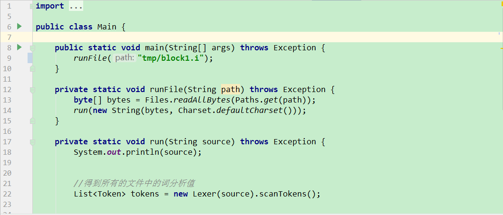
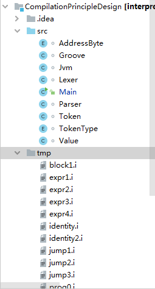
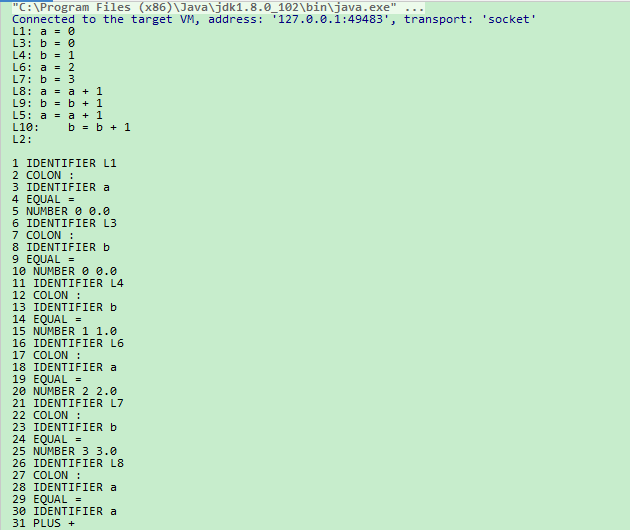
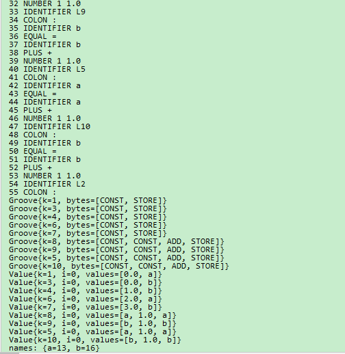
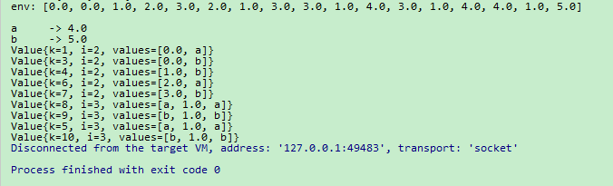

<h1 align="center">编译解释器设计与实现</h1>

## 简介
编译解释器项目，功能包括调试输出、代码解析、词法分析、语法分析和中间代码生成，为开发与测试提供了模块化结构。    --计算机毕业设计源码；毕设源码；java毕业设计源码

## 联系方式

<h3 align="center">获取完整代码与数据库文件 + 微信：bysj5151 QQ: 86050149 QQ群: 783742310</h3>

<h3 align="center">可帮忙远程部署 包运行成功！提供远程部署、修改代码、设计文档指导、代码讲解等服务！</h3>

## 功能介绍（完整见运行截图）
管理员：管理项目结构，包括各个组件和模块文件的存储与组织。负责系统环境的调试和运行，处理变量赋值及环境变量的初始化。监督程序的正常执行，确保编译解释器的调试环境和过程输出的准确性。

用户：运行Java代码实现基本编译结构，通过读取文件并输出内容，执行词法分析生成标记列表。体验项目各个模块的功能，如词法分析、语法分析及中间代码生成等过程，并查看相关输出信息。利用词法分析与中间代码生成结果进行程序调试和验证编译过程的正确性。

开发者：设计和实现编译解释器，管理项目中不同模块的联动与测试。开发词法分析、语法分析以及中间代码处理功能。负责调试输出信息结构化数据的显示与解读，跟踪变量状态和计算结果。优化整个编译过程确保有效性和正确性。

测试员：使用tmp文件夹内的.i扩展名文件进行中间代码或测试，验证编译器的功能模块。检查词法分析与中间代码生成过程中的标识符和运算符的识别结果，提供测试反馈确保系统性能稳定。

## 运行截图

本代码来源于网络,仅供学习参考使用!

